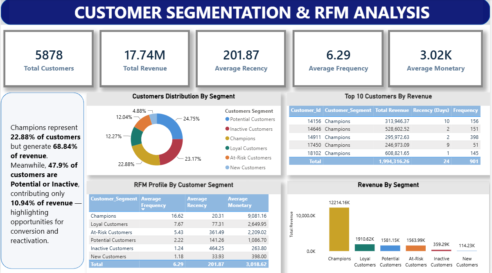

# Customer Segmentation & RFM Analysis
An RFM-based customer segmentation analysis to identify customer groups, understand their purchasing behavior, and evaluate their contribution to overall revenue.

---

## Overview
This project analyzes customer purchasing behavior using RFM (Recency, Frequency, Monetary) analysis.
The analysis uses the Online Retail II dataset and applies SQL to calculate customer-level RFM metrics and assign customers to meaningful segments.
The results are then presented through a Power BI dashboard to understand customer distribution, revenue contribution, and customer value.

---

## Problem Statement
The objective of this analysis is to understand customer purchasing behavior and identify different customer segments based on their transaction history.
The analysis focuses on:

- Measuring how recently customers made a purchase.
- Understanding how frequently customers purchase.
- Measuring the monetary value generated by each customer.
- Segmenting customers based on their RFM scores.
- Identifying high-value customers.
- Understanding revenue contribution by customer segment.
- Identifying inactive and at-risk customers for potential reactivation opportunities.

---

## Dataset

**Dataset:** Online Retail II
The dataset contains transactional records of an online retail business, including:
- Invoice
- Stock Code
- Product Description
- Quantity
- Invoice Date
- Price
- Customer ID
- Country

For this analysis, cancelled transactions, missing customer IDs, non-positive quantities, and non-positive prices were excluded from the RFM calculations.

---

## Tools & Technologies Used
- **MySQL** – Data preparation, RFM calculation, customer segmentation, and SQL analysis
- **Power BI** – Data visualization and dashboard development
- **SQL** – Data transformation and business analysis

---

## Methods
### 1. Data Filtering

The analysis excludes:
- Cancelled invoices
- Transactions without Customer ID
- Transactions with Quantity <= 0
- Transactions with Price <= 0

### 2. RFM Calculation
Three customer-level metrics were calculated:
**Recency**
Number of days since the customer's most recent purchase.
**Frequency**
Number of distinct invoices generated by the customer.
**Monetary**
Total customer revenue calculated as:
`Quantity × Price`

### 3. RFM Scoring
Customers were divided into five groups using SQL `NTILE(5)` scoring for:
- Recency
- Frequency
- Monetary

### 4. Customer Segmentation
Customers were classified into six segments:
- Champions
- Loyal Customers
- New Customers
- Potential Customers
- At-Risk Customers
- Inactive Customers

### 5. Business Analysis
The analysis evaluates:
- Customer distribution by segment
- Average RFM metrics by segment
- Revenue contribution by segment
- Customer contribution by segment
- Top 5 customers by revenue

---

## Key Insights

### 1. Customer Base
The analysis covers **5,878 customers** generating approximately **17.74M in total revenue**.
The overall average values are:
- Average Recency: **201.87 days**
- Average Frequency: **6.29 purchases**
- Average Monetary Value: **3.02K**

### 2. Champions
Champions represent approximately **22.88% of customers** but contribute approximately **68.84% of total revenue**.
This segment has the highest average frequency and monetary value and contributes the largest share of overall revenue.

### 3. Potential & Inactive Customers
Potential Customers and Inactive Customers together represent approximately **47.9% of the customer base**, while contributing approximately **10.94% of revenue**.
This indicates a substantial portion of customers has relatively low current revenue contribution and may require further engagement or reactivation analysis.

### 4. Customer Distribution
The customer distribution across segments is:
- Potential Customers – **24.75%**
- Inactive Customers – **23.17%**
- Champions – **22.88%**
- Loyal Customers – **12.27%**
- At-Risk Customers – **12.04%**
- New Customers – **4.88%**

### 5. Revenue Distribution
Revenue contribution varies significantly across segments:
- Champions – **12.21M**
- Loyal Customers – **1.91M**
- Potential Customers – **1.58M**
- At-Risk Customers – **1.56M**
- Inactive Customers – **0.36M**
- New Customers – **0.11M**

### 6. Top Customers
The analysis identifies the top 5 customers based on total revenue, allowing high-value customers to be examined at an individual customer level.

---

## Dashboard

The Power BI dashboard provides an interactive view of customer segmentation and RFM analysis, including:

- Total Customers
- Total Revenue
- Average Recency
- Average Frequency
- Average Monetary Value
- Customer Distribution by Segment
- Revenue by Segment
- RFM Profile by Segment
- Top 5 Customers by Revenue

RFM_Dashboard.png
---

## Result & Conclusion
The analysis shows that customer value is highly concentrated across RFM segments.
Champions contribute the majority of revenue despite representing a smaller portion of the total customer base. At the same time, Potential, At-Risk, and Inactive segments represent a significant portion of customers and provide areas for further customer engagement and reactivation analysis.
The combination of SQL-based RFM analysis and Power BI visualization provides a structured view of customer behavior and revenue contribution that can support customer retention, engagement, and segmentation decisions.

---

## Author

**Kajal Gaud**
 Final Year B.Tech Computer Science Engineering | Aspiring Data Analyst
LinkedIn: www.linkedin.com/in/kajal-gaud-30798331a

Email: kgaud252@gmail.com
